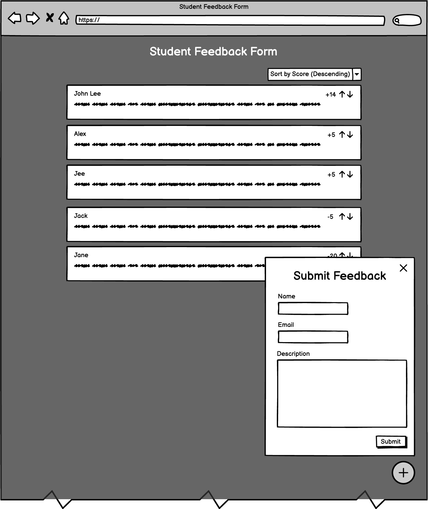

# Student Feedback Form
Welcome to your take-home assignment! This guide outlines your task to develop a student feedback form application, complete with setup instructions and assignment requirements.

## Problem Statement
A school has recently decided to implement a new feedback system for students to provide feedback to the school.  Anticipating a substantial volume of potentially redundant feedback, the school is keen on adopting a crowdsourced approach. In this system, submitted feedback will be visible to the students, enabling the community to highlight the most pertinent points through an upvote/downvote mechanism.

The school has selected you to create a Minimum Viable Product (MVP) of this application to evaluate the concept's viability prior to commissioning a comprehensive, in-house version. To facilitate this, the school has provided you with a foundational template that is compatible with their existing technology infrastructure, allowing you to commence development promptly.

## Requirements

Your task involves creating a minimum set of functionalities outlined as follows:

1. **Design Implementation**
   - Develop a Single Page Application (SPA) based on the provided low-fidelity wireframe.
   - Utilize [`@fluentui/react-components`](https://react.fluentui.dev/) library as the primary component library to construct your application, ensuring a consistent design language that aligns with the school's existing applications.
   - You should be using the included CSS-in-JS solution ([Griffel](https://react.fluentui.dev/?path=/docs/concepts-developer-styling-components--page)) to style your components.
   - The application should be responsive and mobile-friendly, you can make assumptions for how the applicant scales on smaller screens.

2. **Form Submission**
   - Construct a feedback submission form with the following fields:
      - Name
      - Email
      - Description
    - Upon submission, the feedback should be captured by the backend API and stored in the database.

3. **Feedback Listing**
    - Display a list of feedback submitted by students, including the following information:
        - Name
        - Description
        - Feedback Score
        - Upvote/Downvote Buttons
    - Initially, sort the feedbacks by feedback score in descending order.
    - Allow students to sort the feedbacks by the following criteria:
        - Feedback Score (Highest to Lowest, Lowest to Highest)
        - Date (Newest to Oldest, Oldest to Newest)

4. **Feedback Voting**
    - Enable students to upvote or downvote feedback.
    - Update the feedback score accordingly and re-sort the feedback based on the current sorting filter.

### Lo-Fi Wireframe


### Assumptions
For this simplified exercise aimed at gaining insights into your working style, the following assumptions can be made (though not limited to these):

- User authentication is not a requirement for this application, and all API endpoints are publicly accessible.
- There's no need to prioritize data sensitivity or scalability of the provided `sqlite3` solution.
- The given low-fidelity wireframe serves as a basis, but you are free to make design assumptions regarding spacing, padding, copy text, etc. You are also allowed to ask questions if you need clarifications. Pixel-perfect design is not an evaluation criterion in this assignment.
- You have the flexibility to include third-party dependencies not listed in the current `package.json` file, but it's essential to justify your choice of dependencies in the `SOLUTION.md` file.
- The focus is not on production deployment considerations (e.g. Docker, CI/CD). You can assume that the application will only be run locally.
- Please refrain from using any Language Model Models (LLMs) to generate code for this assignment, as it impacts our ability to assess your work. The primary goal of this take-home assignment is to understand your thought process and approach.
- In real life, the existing code given by clients is often not perfect. You are free to refactor the code as you see fit, and point out what could be improved in general.

## Boilerplate Overview
This boilerplate is structured as a monorepo using pnpm workspaces and Nx, featuring a backend API built with NestJS and a frontend application created with Next.js.

## Prerequisites
Before you begin, ensure you have the following installed on your system:
- Node.js (`v20.9.0`, defined in `.npmrc`)
- pnpm (`v8.x.x`)
- Nx CLI (`v17.x.x`, install globally using `pnpm install -g nx`)

## Setup Instructions
1. **Install dependencies**

    Navigate to the root of the project and run:

    ```sh
    pnpm install
    ```

    This will install all the necessary dependencies for both the backend and frontend projects.

2. **Configure environment variables**

    Copy the `.env.example` files located in root folder to `.env` and fill in the necessary environment variables (if any).

    ```sh
    cp .env.example .env
    ```

3. **Start the development servers**

   With Nx, you can easily run both the backend and frontend projects concurrently with
    ```sh
    pnpm run dev
    ```

    To start the backend API (standalone):
    ```sh
    pnpm run dev:api
    ```

    To start the frontend application (standalone):
    ```sh
    pnpm run dev:web
    ```

    The backend API will be available at `http://localhost:3333/`, and the frontend will be available at `http://localhost:3000/`.

4. **Access the application**

    Open your browser and navigate to `http://localhost:3000/` to view the frontend application.

5. **Application Testing**

   You can run tests on both the backend and frontend projects concurrently with
    ```sh
    pnpm run test
    ```

    To test the backend API (standalone):
    ```sh
    pnpm run test:api
    ```

    To test the frontend application (standalone):
    ```sh
    pnpm run test:web
    ```

## Submission Guidelines
- Make sure to write clear, maintainable code with comments where necessary.
- Include unit tests for both the frontend and backend.
- Feel free to use `SOLUTION.md` file in the root of the project, detailing your approach and any assumptions made.
- As a final step, please use the given `zip-submission.sh` script (you might need to run `chmod +x ./zip-submission.sh`) and attach the generated zip in your email correspondence.

## Questions?
If you have any questions or run into any issues, please don't hesitate to reach out to us at our email correspondence.

Good luck with your assignment!
